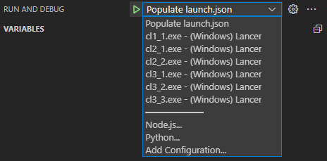

# Codility Lessons

## Lessons

| Number | Name                  |
| ------ | --------------------- |
| 1-1    | BinaryGap             |
| 2-1    | CyclicRotation        |
| 2-2    | OddOccurrencesInArray |
| 3-1    | FrogJmp               |
| 3-2    | PermMissingElem       |
| 3-3    | TapeEquilibrium       |

## Build details

Upon Cmake configure, executable targets for each .cpp file inside `src/lessons/` are automatically added.

After building Run the debug task `Populate launch.json` to add all built executable files as debug targets.s

Inside VsCode, debug targets can be switched inside the "Run and Debug" menu.

